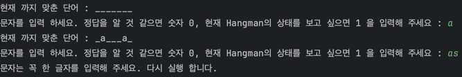
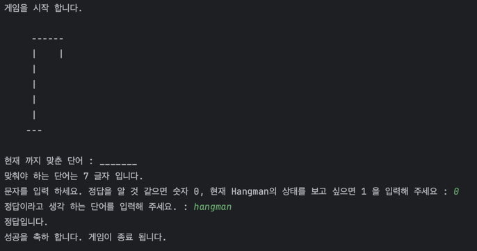
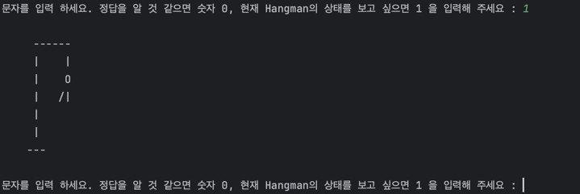
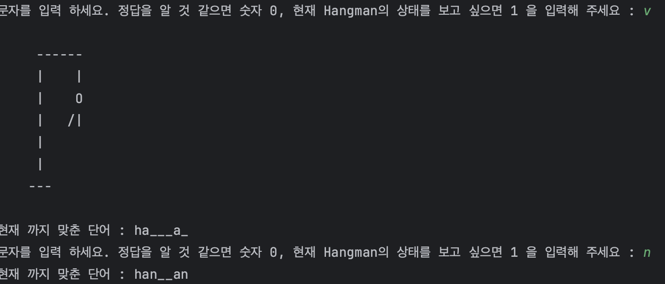

# python으로 만드는 hangman 게임

## flow
- 정답으로 확인할 answer를 정해준다.
- 정답을 갖는 HangManGame객체가 생성된다
- 게임을 시작한다.
- 7회 안에 단어를 맞춰야 한다.
- 실패하면 행맨이 죽는다.


## 구현 사항

- [x] 두 글자 입력 시 retry

    

- [x] 단어를 몰라도 잘 찍으면 성공

    
 
- [x] 현재 행맨의 상태만을 볼 수 있다
 
    
 
- [x] 문자를 맞추는 거슬 성공 했으면 행맨의 상태가 변하지 않기 때문에 출력 하지 않는다.
 
    

- [x] 정답과 비교할 문자열 모두 대소문자를 구분하지 않는다

    ``` python
        def __is_same(self, word: str) -> bool:
        self.is_success = word.lower() == self.answer.lower()
        return self.is_success
    ```


